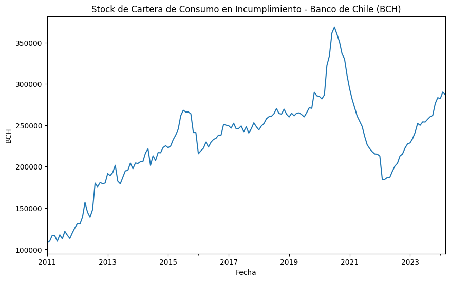
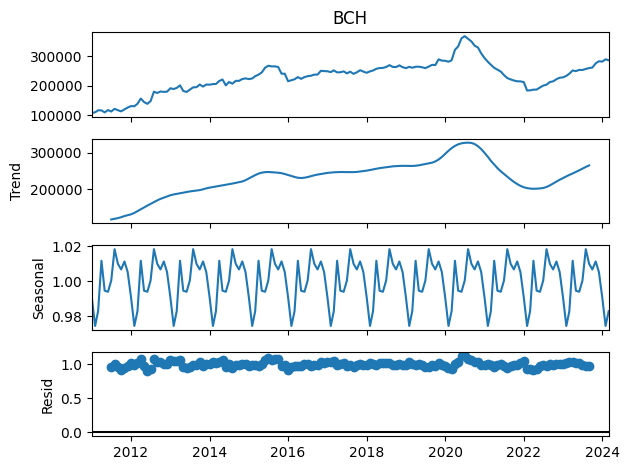
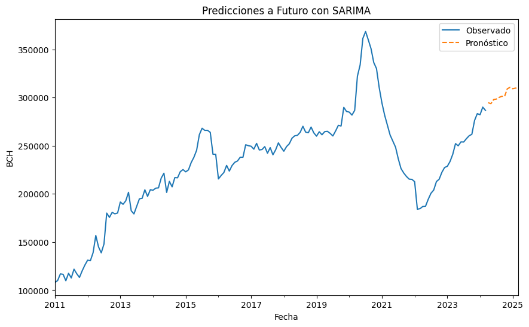
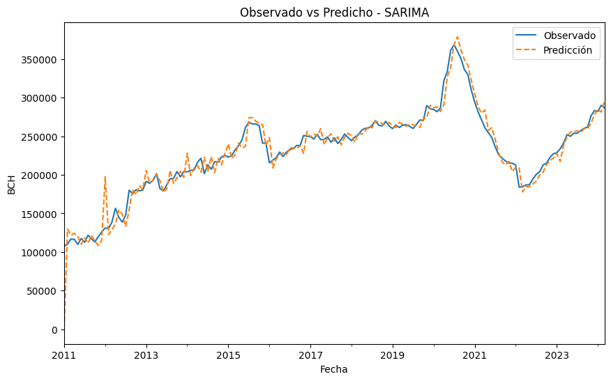

# Predicción del Stock de Cartera de Consumo en Incumplimiento - CMF Chile 📊

Este proyecto presenta un análisis de series temporales utilizando el modelo **SARIMA (1,1,1)x(1,1,1,12)** para predecir el **stock de cartera de consumo en incumplimiento** del **Banco de Chile (BCH)**, basado en datos descargados desde la **Comisión para el Mercado Financiero (CMF) de Chile**. El objetivo es aplicar técnicas avanzadas de series temporales para entender el comportamiento histórico de la cartera en incumplimiento y proyectar su evolución futura.

---

## Tabla de Contenidos

1. [Descripción del Proyecto](#descripción-del-proyecto)
2. [Estructura del Proyecto](#estructura-del-proyecto)
3. [Metodología](#metodología)
4. [Exploración y Visualización de Datos](#exploración-y-visualización-de-datos)
5. [Modelo SARIMA](#modelo-sarima)
6. [Evaluación del Modelo](#evaluación-del-modelo)
7. [Instalación y Uso](#instalación-y-uso)
8. [Predicciones](#predicciones)
9. [Conclusiones y Resultados](#conclusiones-y-resultados)
10. [Futuras Mejoras](#futuras-mejoras)
11. [Autor](#autor)


---

## Descripción del Proyecto

El dataset usado en este proyecto contiene registros mensuales de la página web de la Comision para Mercados Financieros (CMF) desde enero de 2011 hasta marzo de 2024 del stock de cartera en incumplimiento para el **Banco de Chile (BCH)**. A través de un análisis de series temporales, hemos implementado un modelo **SARIMA** que toma en cuenta tanto la tendencia como la estacionalidad presente en los datos.

El modelo ha sido ajustado para proporcionar predicciones sobre el comportamiento futuro del stock de cartera en incumplimiento, con el fin de identificar posibles riesgos y proyecciones para los próximos 12 meses.

---

## Estructura del Proyecto

- **CMF.xlsx**: Dataset con el stock de cartera de consumo en incumplimiento por institución.
- **Proyecto_SARIMA.ipynb**: Notebook de Google Colab que contiene todo el flujo de trabajo, desde la carga de datos hasta la creación del modelo y la generación de predicciones.
- **predicciones_CMF_BCH.xlsx**: Archivo con las predicciones del modelo para los próximos 12 meses.
- **README.md**: Este archivo, que describe el proyecto, su estructura y cómo ejecutarlo.
  
---

## Metodología

El proceso seguido en este proyecto se desglosa en los siguientes pasos clave:

1. **Carga y Exploración de los Datos**: Revisión inicial del dataset para asegurarnos de que los datos estén correctamente estructurados.
2. **Transformación de Datos**: Combinación de las columnas `YEAR` y `MONTH` en una sola columna de tipo `date`, que se utiliza como índice para la serie temporal.
3. **Análisis Exploratorio**: Gráficos de la serie temporal para identificar tendencias y patrones estacionales.
4. **Ajuste del Modelo SARIMA**: Construcción de un modelo SARIMA para capturar la tendencia, estacionalidad y variabilidad en los datos.
5. **Evaluación del Modelo**: Evaluación de los resultados mediante criterios como el AIC, BIC y el test de Box-Ljung.
6. **Predicciones**: Proyección de la serie temporal para los próximos 12 meses.

---

## Exploración y Visualización de Datos

La visualización inicial de los datos reveló tanto una **tendencia de crecimiento** en el stock de cartera en incumplimiento como un **patrón estacional**, lo que justificó el uso de un modelo SARIMA.

**Gráfico Exploratorio:**




Se observan patrones estacionales anuales que nos llevaron a ajustar el parámetro estacional en el modelo SARIMA. 
Visualizamos la serie para observar patrones de tendencia, estacionalidad, etc.





---

## Modelo SARIMA

El modelo ajustado tiene la siguiente estructura:

- **SARIMA (1,1,1)x(1,1,1,12)**

Este modelo fue seleccionado tras pruebas con diferentes órdenes ARIMA y SARIMA, y análisis de criterios como AIC y BIC.

**Resumen del Modelo:**

```bash
SARIMAX Results                                      
==========================================================================================
Dep. Variable:                                BCH   No. Observations:                  159
Model:             SARIMAX(1, 1, 1)x(1, 1, 1, 12)   Log Likelihood               -1556.762
AIC                           3123.525
BIC                           3138.443


## Evaluación del Modelo

El modelo **SARIMA (1,1,1)x(1,1,1,12)** fue evaluado utilizando diferentes métricas estadísticas como el AIC, BIC, y el test de Box-Ljung. Los resultados sugieren que el modelo capta adecuadamente la estacionalidad de los datos, con una reducción significativa en los valores de AIC y BIC en comparación con otros modelos probados.

- **AIC** 3123.525
- **BIC** 3138.443
- **Test de Box-Ljung** Indica que los residuos no son ruido blanco, lo que sugiere que el modelo puede mejorarse aún más.

## Instalación y Uso

   Clona este repositorio en tu máquina local:
   ```bash
   git clone https://github.com/Omarzg92/Modelo-Sarima.git


## Asegurate de tener instaladas las bibliotecas necesarias. Ejecutando: 

pip install pandas numpy matplotlib statsmodels

### Predicciones

El modelo SARIMA predice un crecimiento continuo en el stock de cartera de consumo en incumplimiento, con fluctuaciones estacionales observadas en los últimos años.

### Observados vs Predicho


Las predicciones muestran una tendencia de crecimiento y estacionalidad clara, similar a los años anteriores.

## Conclusiones y Resultados

El modelo **SARIMA** ha sido capaz de capturar la tendencia y estacionalidad presente en los datos históricos. Los resultados sugieren que el **stock e cartera en incumplimiento** del **Banco de Chile** seguirá un patrón de crecimiento con fluctuaciones estacionales a lo largo del próximo año.

Este modelo es útil para proyectar el comportamiento futuro de la cartera en incumplimiento, pero podría mejorarse incorporando más variables macroeconómicas o financieras externas que influyan en la morosidad.

## Futuras Mejoras

- Probar otros modelos de series temporales
- Incorporar variables adicionales o datos exógenos (por ejemplo, indicadores macroeconómicos) para mejorar la precisión del modelo.
- Ajustar los parámetros del modelo SARIMA mediante técnicas avanzadas de optimización.

## Autor

- **Omar Zambrano** - [GitHub](https://github.com/omarzg92) | 
